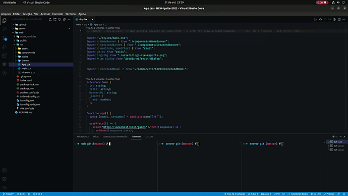
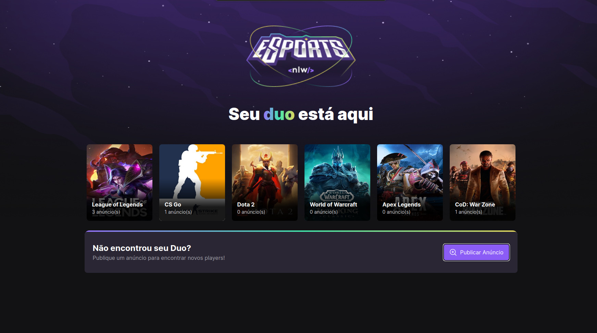
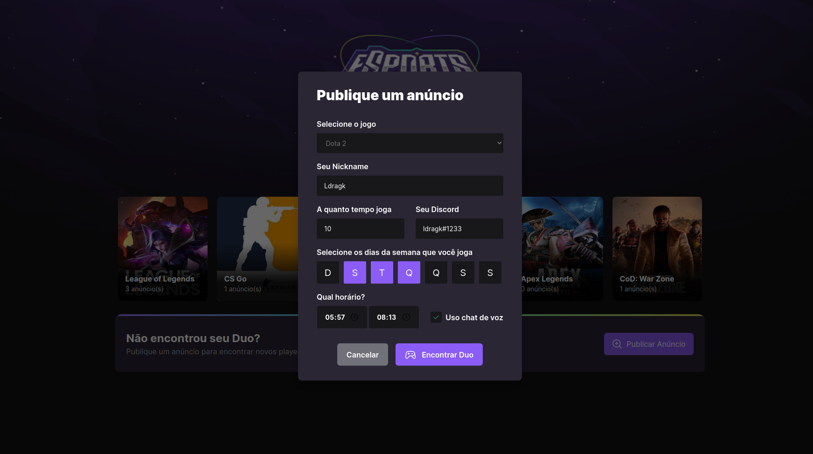

<h1 align="center">NLW Ignite eSports 2022</h1>

  <a href="#-tecnologias">Tecnologias</a>&nbsp;&nbsp;&nbsp;|&nbsp;&nbsp;
   <a href="#-instalação">Instalação</a>&nbsp;&nbsp;&nbsp;|&nbsp;&nbsp;
  <a href="#-projeto">Projeto</a>&nbsp;&nbsp;&nbsp;|&nbsp;&nbsp;&nbsp;    

</a>
  

</a>
</a>
Projeto desenvolvido no NLW Ignite eSports 2022. 

  

## 🚀 Tecnologias

<h2>Global</h2> 

* 
JavaScript

* [TypeScript](https://www.typescriptlang.org/)

 

<h2>Front-End WEB</h2>  

* [Vite](https://vitejs.dev/)
* [React](https://pt-br.reactjs.org/)
* [TailWind](https://tailwindcss.com/)

 

<h2>Back-End</h2> 

* [Node e NPM](https://nodejs.org/)
* [Prisma](https://www.prisma.io/)
* [SQLite](https://www.sqlite.org/index.html)
  

## 💻 Instalação

$ cd server

$ type nul > .env

 

<h4>Dentro do arquivo .env:</h4>

DATABASE_URL="file:../src/database/db.sqlite"   

<h2>Servidor</h2> 

$ cd server
 

$ npm install

$ npx prisma generate

$ npm run dev

$ npx prisma studio

 

<h2>Web</h2> 

$ cd web

$ npm install

$ npm run dev

  

## 🔖 Projeto

 O projeto tem a finalidade de ajudar jogadores de jogos online a encontrarem uma equipe para jogar, assim possibilita que criem anúncios para que outros jogadores possam ver e escolher jogar junto. Nos anúncios é possível informar várias características sobre o jogador e suas preferências de jogabilidade.

  

<h1 align="center">Contato</h1>

  
        
          

 
